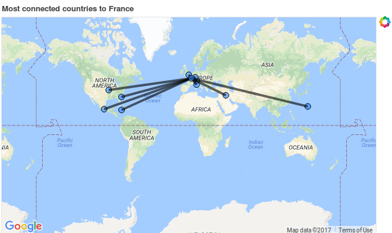

## {{page.subtitle}}  
    
    
  
### Introduction to the Panama Papers

The Panama papers were released in 2015, they constitue the biggest leak of financial information in history before the recent Paradise papers leak. It first came from the Panamanian corporate service company Mossack Fonseca. The leak revealed a substantial amount of illegal activities including fraud and tax evasion. It especially revealed illegal financial activities carried out by world's biggest wealth holders, politicians and companies. A leak of that size is a very powerful resource to address the problem of tax evasion. Despite obviously the Panama Papers are not an exhaustve list of the hidden financial activities. 

##### Panama papers in numbers
 
The Panama Papers are 11.5 millions leaked documents that detail financial and attorney–client informations for more than 214,488 offshore entities. Some 4.8 millions leaked files were emails, 3 millions were database entries, 2.2 millions PDFs, 1.2 millions images, 320,000 text files, and 2242 files in other formats. Journalists from 107 media organizations in 80 countries analyzed documents detailing the operations of the law firm. After more than a year of analysis, the first news stories were published on April 3, 2016, along with 150 of the documents themselves.  
The sheer quantity of leaked data greatly exceeds the WikiLeaks Cablegate leak in 2010 (1.7 GB), Offshore Leaks in 2013 (260 GB), the 2014 Lux Leaks (4 GB), and the Swiss Leaks (3.3 GB) of 2015. For comparison, the Panama Papers equals approximately 2'660 GB.

##### A word about Paradise papers before starting
This website is dedicated to the presentation of a data analysis project concerning the Paradise Papers. The project mainly consists in developing tools to better understand the geographical structure of the off-shore leak. The data employed for this project is taken from the International Consortium of Investigative Journalist (ICIJ) website. You might not have missed the fact that recently a leak of comparable importance with the Panama papers leak has been released: the Paradise papers. The latter has also been released by the ICIJ and beneficiate from the same data formatting as the Panama papers. Therefore luckily we are at one step to extend the implementation of the tools that we are going to show you with the Paradise papers. 

--- 

### Outline of the project

This project aims to compile the information provided by the Panama papers to show the geographical structure of offshore activities. We intend to do so thanks to an interactive map showing connections between the different entities and officers concerned by the leak. 
  
##### Research questions  
- Which countries were the most involved in the offshore activities unveiled in the leak?    
- What are the relationships between countries and tax heavens?   
- Where does corruption come from ?     
	
We strongly believe in the usefulness of this kind of project in order to get a better understanding of the worldwide organization of the tax evasion phenomenon. We think that it could help society realize the importance of the event. It could therefore push towards the implementation of new tax regulations to prevent such aberrance. 

##### In quest of interactivity

One of the main guidelines for this project was to make it as interactive as possible. It comes from the idea that for a program to have the greatest impact as possible on the general public it needs to show at least as possible of code and it needs to be as intuitive as possible. That is why we are implementing as much effort as possible to release a web app that could be available to everyone. The web app development is discussed at the end of this website where we address the possible future directions to be undertaken. As a matter of transition some `jupyter notebook` scipts have been implemented which roughly show the kind of features that are intended to be implemented in the web app. The `jupyter notebook` scripts are available on the [github repository of the project](https://github.com/adrienruault/ada_molmaru/tree/master/project).

----
  
### Tax Evasion

From our analysis it becomes very clear they are few countries able to attract, keep and hide large amount of money from foreign tax authorities. It is clear the main incentive to create offshore accounts/companies is the savings on taxes allowed by a lack of economic policies in those countries.     
The pattern to tax evasion becomes almost simple when spotlighted. A company or private individual may create a "Shell company" in the country of his choice, preferably where regulations are weak, for example, no need to name the owner. These shell companies, also called Offshore Entities, are usually limited liability companies and don't conduct any business, they just own financial assets of their owner. To fullfill a tax evasion, they also need a go-between with a service provider, these intermadiaries usually are law-firms, banks or middlemen that asks an offshore service provider to create an offshore firm for a client. Finally, bearers are the entities receiving shares from an offshore company, unfortunately bearer shares provide one of the deepest levels of secrecy.  

  

  
Nomenclature:  
- **Offshore Entity** : A company, trust or fund created in a low-tax, offshore jurisdiction by an agent.   
- **Officer** : A person or company who plays a role in an offshore entity.   
- **Intermediary**: A go-between for someone seeking an offshore corporation and an offshore service provider -- usually a law-firm or a middleman that asks an offshore service provider to create an offshore firm for a client.  
 
 
    
    

---

### Leading Actors
The map above shows the worldwide distribution of the three main kinds of actors : which are Offshore entities, Intermediaries and Officers. We notice those three differ from each other on a global scale even though some countries are well represented in all three cathegories. 
Regarding the offshore entities, we must notice the presence of the three economic global powers : USA, China and Russia. But they are, by far, not the more effcicient hosting countries. Indeed, in Europe, Switzerland is leading with more than 37 thousands hosted entities (10 times more than Russia), followed by Luxembourg and Great Britain. In South America, Panama has a large capital of offshore entities. In western Asia, United Arab Emirates is also leading.
The Intermediaries are once again most located in Switzerland and Great Britain, as they are known for the privacy of their bank services. Still, the distribution of the intermediaries is very similar to the offsore entities distribution on a global scale.
Finally, we notice the southern countries are more involved in the officer distribution. Usually officiers are settled in different juridiction than the company/private individual at the origin of the tax evasion.

  
	   

### Queries

#### Density maps

The tools that we developed in the frame of this project are able to show density maps representing the level of off-shore activities per country. The level of off-shore activity is actually simply measured by the number of financial actors per country repertoriated in the database. This tool has the ability to scale so that the user can be able to see some part of the world more in details. It can be very useful in the context of off-shore analysis because the most important actors are often established in small tax heavens.

#### Connection queries

We also provide a tool that let the user request a particular individual of the dataset. He/she can do so by querying its name and by applying filters concerning its nationality or its role in the financial system. When querying such an individual the database retrieves all its relationships. Then a graph is generated whose nodes are the items of the database that are directly conncted to the queried individual. Moreover the edges of the graph are used to label the relationship between two vertices of the graph. Then this graph is put in context in a map which gives much more sense to it. You can play with this tool running the `connection_query.ipynb` or the `main_pipeline.ipynb` files on our [github](https://github.com/adrienruault/ada_molmaru/tree/master/project).

#### Country connections

Another too that is available with our app is a feature that allows to choose a country and to query the countries that are the most closely related to the latter in terms of off-shore financial activities. It is a quite useful tool that allows to better understand the relationships between the countries.

From the raw dataset, we were able to designe a tool to query for types, names and locations 
The provided dataset allow us to investigate for specific relationships  

{:class="img-responsive"}

---

### Web App

As the aim of the project was to be able to share an intuitive web application for processing simple geographical queries on the Panama Papers dataset, we focused a lot our work on the exportation of the widget obtained after milestone 2. After some research, we understood that folium was not really suitted tp share the widget out of the jupyter notebook context. It also appeared that exporting the ipywidgets we used was pretty complicated. We finally found the library "Bokeh", which seemed to propose more solutions for the exportation of our app. We thus recoded our widgets on the basis of Bokeh maps, which were found to be a bit more complicated to use, but also provided new interesting fuctionalities. After the refactoring of the code, we tried to give a public access to our app, following the instructions of a [google tutorial](https://cloud.google.com/solutions/bokeh-and-bigquery-dashboards). This tutorial proposed to use a google cloud computing machine to host the Bokeh sever of the web app, in combination with docker to provide well suited containers. Unfortunately, it appeared that we did not have the required knowledge to achieve this task: we still get some issues with the Bokeh server that is not able to find or launch our python code. We are a bit disappointed because we wanted the web app to be ready for this deadline. However, we are still going to try releasing it for the presentation of january, as it was important for us to make this app shareable, and also because that we think we are not far from our goal. For the moment, the Bokeh application is avalaible on github and can be run on a machine with Bokeh installed (can be installed with pip). To run it, you can just go in the /project folder of our [ADA github repository](https://github.com/adrienruault/ada_molmaru.git), and run the command "bokeh serve --show ." (do not forget to download the data and to run the preprocessing as described in the README). Here is an overview of the generated app (run in localhost :'( ):  

{:class="img-responsive"}

### Full Project

The full project is available on a [github repository](https://github.com/adrienruault/ada_molmaru/tree/master/project). It provides a Jupyter Notebook processing the data from the Panama Papers & Paradise Paper with a performant query tool to geographically display portions of actors involved in cash criminality. This tool was not implemented in this html page due to a lack of time and compliance between python's libraries and html.   
The datasets was downloaded from [The International Consortium of Investigative Journalists](https://offshoreleaks.icij.org/pages/database) website.

